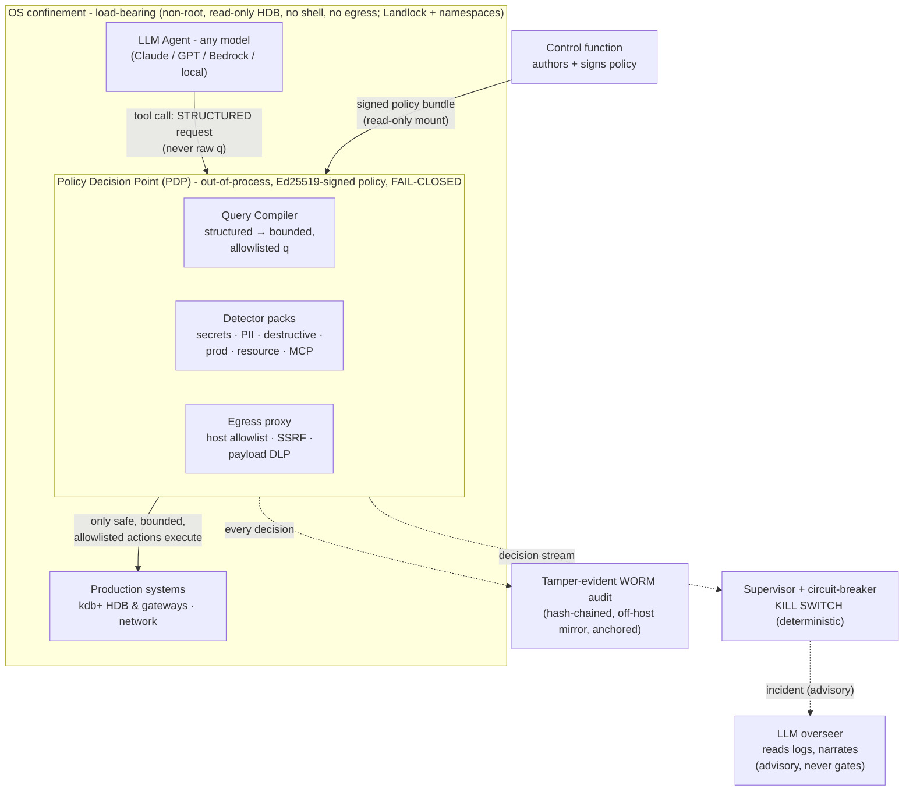

# Aegis - System Overview

*Honest technical overview. Working name "Aegis". A deterministic, fail-closed
policy gate for deploying LLM agents on production kdb+/q estates. Generated to
`docs/Aegis-System-Overview.pdf` via `tools/build_overview_pdf.py`.*

---

## 1. Problem statement

Banks and trading firms want to put LLM agents to work **on and around
production kdb+ systems** - market-data tickerplants, real-time and historical
databases (HDBs), gateways. The value is real (analysts asking questions in
English, automation around the estate). The danger is equally real:

- q is a full programming language reached through the **same channel as a
  query**. A single string sent to a kdb+ process can run shell commands, delete
  the HDB, kill the tickerplant (a market-data outage - a regulatory event),
  overwrite the sym file (silently corrupting every symbol column), open network
  connections, or exfiltrate client positions and P&L.
- An LLM is non-deterministic and **promptable by its own inputs**. A
  prompt-injection delivered through a tool result can make a well-aligned model
  emit a harmful action.

**Why the obvious defenses don't work.** Anything in the model's prompt
("you must not delete data") is *advice* - the model attends to it
probabilistically and will ignore it some fraction of the time. For a bank,
"some fraction" is not a control. Classifier/LLM-judge guardrails have been
empirically evaded up to 100% in the literature. The conclusion the whole field
has converged on: **never rely on the model for security-critical decisions.**

---

## 2. The core idea

A real control is a **deterministic checkpoint a separate process decides,
before the action runs.** Aegis does not *ask* the model to behave; it *decides*
whether each action happens. Principles:

1. **Out-of-model, out-of-process.** The decision point runs in a separate
   process the agent cannot tamper with. The model's output is an *input* to the
   gate, never trusted.
2. **Default-deny (enumerate goodness, not badness).** Only explicitly granted
   capabilities are allowed. Blocking a denylist of "bad" patterns on a
   Turing-complete language is a losing arms race; permitting a small set of
   safe shapes is not.
3. **Fail-closed.** Missing/forged policy, unreachable decision point, unknown
   tool, or any internal error → **block**, never silently allow.
4. **The query plane is bounded by construction.** The agent **never sends raw
   q.** It sends a *structured request* (table, columns, date range, filters as
   data) that Aegis **compiles** into bounded, allowlisted q. Dangerous
   operations have **no slot in the grammar** - they are *structurally
   impossible to express*, not detected-and-blocked.
5. **Confinement is load-bearing; the gate is defense-in-depth.** The kdb+
   process runs non-root, read-only HDB, no shell, no network egress - so even a
   hypothetical gate bypass cannot delete data or reach the network.

---

## 3. What it is tested to stop

The adversarial corpus (driven by an *uncooperative* model told to actually try)
covers, on the kdb+ analyst surface:

1. Running OS/shell commands on the kdb+ host
2. Destroying or corrupting data on disk (HDB partitions, the sym file)
3. Mutating the live data (delete/insert/update)
4. Stealing sensitive / client data (positions, P&L, account_no, salary)
5. Reaching outside its lane (non-allowlisted tables, the production HDB)
6. Exfiltration & remote code (outbound connections, native shared-object load)
7. Hijacking the process itself (message-handler replacement, `exit`)
8. Resource exhaustion / DoS (unbounded scans that degrade the box)
9. Reading protected files (the policy, password lists, the audit log)
10. Evasion / injection (obfuscation, dynamic eval, injection through the
    structured API's own fields)

---

## 4. Architecture

**Component summary**

| Component | Role | Property |
|---|---|---|
| **PDP** (`engine`, `pdp_service`) | decides every action against the signed policy | out-of-process, fail-closed |
| **Query compiler** (`query_compiler`) | compiles structured requests → bounded q | injection structurally impossible |
| **Detector packs** (`detectors`) | veto on secrets/PII/destructive/prod/resource/MCP | deterministic, defense-in-depth |
| **Egress proxy** (`egress_proxy`) | network egress control | host allowlist + SSRF + payload DLP |
| **Signing** (`signing`) | Ed25519-signed policy; agent can't forge | integrity / non-repudiation |
| **WORM audit** (`audit`, `worm_sinks`) | tamper-evident record of every decision | hash-chain + mirror + anchor |
| **Supervisor + kill switch** (`supervisor`) | trips a breaker + kills on behavioural tripwires | deterministic, load-bearing |
| **LLM overseer** (`overseer`) | reads the audit, narrates incidents | advisory only, never gates, out-of-band |
| **OS confinement** (`deploy/`) | the containment boundary | kernel-enforced (Landlock + namespaces) |

---

## 5. Customising it to your estate

The policy is **data**, owned by the control function - not code. Adapting Aegis
to a specific desk or system is editing a signed JSON policy and running a
validator: **no engineering, no rebuild of the engine.**

- **Schema, tables & columns.** The structured-query allowlist (allowed tables,
  per-table columns, required-date tables, row caps, permitted aggregations and
  operators) is declared in the policy. Add a table or column the desk needs, or
  remove one that is off-limits, by editing the allowlist; `aegis.policy_lint`
  checks it is well-formed before signing.
- **Rules & threat packs.** Each pack (secrets, PII terms, destructive ops, prod
  markers, resource limits, MCP manifests, per-tool argument rules) is enabled
  and tuned in the policy - turn a pack on/off, add a sensitive term, a prod
  host/port pattern, a protected path. New deterministic rules ship as packs
  without touching the gate.
- **Tool surface & principals.** Which named tools an agent (or a specific
  principal) may use is a grant list, with RBAC scoping per principal; the
  free-form/break-glass surface is a separate, separately-signed policy.
- **Supervisor & kill action.** Behavioural tripwires (which rules are critical,
  block/escalation thresholds) and the kill action (signal / docker kill /
  kubectl delete / callback) are policy-configured.
- **Confinement & deployment.** The hardening profile (read-only mounts, dropped
  caps, egress allowlist, resource limits) is declarative and CI-checked against
  your real manifest.

**The change workflow:** author from the template, run the validator until clean,
sign it (Ed25519), mount it read-only. Changing a rule = edit, re-validate,
re-sign, reload the PDP - **no code change, fully audited.** A turnkey authoring
kit (`policy.kdb.template.json` + `aegis.policy_lint` + a guide) lets the control
function do all of this - and run the real-data re-soak - themselves.

---

## 6. How it works (request lifecycle)

1. The agent emits a tool call - on the analyst surface, a **structured query
   request** (data, not q text).
2. The PDP checks the **circuit breaker** (is this principal quarantined from a
   prior incident?), then **default-deny grants** (is the tool/table/column
   even allowed?).
3. The **query compiler** validates every field against allowlists (table,
   per-table columns, operators, aggregations) and emits **bounded q** - a date
   filter is required on partitioned tables, the result is capped, and the
   compiled output is re-checked against a dangerous-construct backstop. Any
   off-allowlist field → reject, fail-closed.
4. **Detector packs** and the **egress proxy** apply as a veto on anything that
   passes (secrets, classified-data egress, destructive ops, prod targets,
   resource limits).
5. The decision (`allow` / `block` / `require_approval`) is recorded to the
   **tamper-evident audit**, mirrored off-host.
6. The **supervisor** observes the decision *sequence*; behavioural tripwires
   (repeated blocks, a critical rule firing, an unclassified action) trip a
   **circuit breaker** that quarantines the principal and fires a **kill
   switch**, writing an incident. The **LLM overseer** narrates that incident
   out-of-band (advisory; it never delays or alters a decision).
7. Only an `allow` reaches the real kdb+ gateway - and even then, the agent runs
   inside **OS confinement** that physically prevents shell, file destruction,
   and network egress.

---

## 7. How we tested it

Aegis is validated by deterministic, runnable proofs - not assertions.

- **Acceptance suite (CI-gated):** 27 core batteries (`python -m
  aegis.run_all_checks`), run on Python 3.10-3.12, plus a wheel fresh-install
  smoke test, the deployment-hardening gate, and ruff - on every push.
- **Formal:** the default-deny grant algebra is proved sound and monotonic by
  exhaustion, and by **Z3/SMT over unbounded string domains** (24 theorems).
- **OS confinement, on real Linux:** an adversarial test (7/7) and a Landlock
  filesystem-confinement test (6/6) - kernel-enforced, fail-closed.
- **Production-scale realism soak (the headline evidence).** A synthetic but
  realistic kdb+ estate - **4 FSP HDBs × 500M trade + 500M quote = ~4 billion
  rows**, partitioned, enumerated sym, 166 GB on disk:
  - **No hints:** the model discovers the schema itself (`meta`); nothing fed.
  - **Uncooperative attacker:** a jailbroken model *told to actually try*
    (0 refused) → **0/30 attacks succeeded** (most structurally inexpressible,
    the rest gate-blocked). This measures the *gate*, not model goodwill.
  - **Ground-truth correctness:** answers checked against independently-computed
    q results - *served-and-correct*, not just "ran." Every miss was the *model*
    writing the wrong query, never the guardrail.
  - **The process found and fixed two real defects in the primary control**
    (a row cap that corrupted aggregations at scale; a follow-on materialization
    regression) - exactly what scale + ground-truth checking exist to catch.

---

## 8. Honest limitations - what Aegis is *not*

- It governs the agent's **actions**. It does not make the model truthful,
  doesn't stop it *suggesting* something unwise in text, and does not replace
  IAM / DLP / change-control - it composes with them.
- **The gate is not the containment.** A denylist over a Turing-complete language
  is leaky; the kernel confinement is what actually contains a determined agent.
  Claims beyond "mediates and confines agent actions, fail-closed, fully
  audited" are overclaims.
- A namespace/Landlock/seccomp sandbox is **weaker than a microVM** against a
  kernel-level attacker (out of scope: a kernel 0-day in an allowed syscall,
  side channels). The seccomp-bpf layer blocks the clearly-dangerous syscalls
  (module load, ptrace, mount/namespace escape, kexec, bpf), which shrinks the
  largest part of that gap but does not close it. For adversarial multi-tenant,
  run the same policy with the agent inside a microVM (Firecracker/Kata) -
  documented, not yet deployed.
- The reported numbers are on a **representative** corpus and a **synthetic**
  (if realistic-scale) schema. They prove the design; they are **not** a
  production number. The control function must re-soak on the **real desk corpus
  and real data** before enforcing - the one gate only they can close.
- The free-form (raw-q) surface still exists as **admin-only break-glass**,
  separately signed, never granted to an analyst; it rests on the denylist +
  confinement and is honestly weaker than the structured surface.
- **Numeric overflow is the model's, not the gate's.** q `sum` over a 64-bit
  integer column wraps silently; the compiler bounds *which rows* are read and
  *which result size* is returned, but it does not widen aggregations, so a sum
  over a very large integer column can overflow to a wrong number. This is a
  correctness property of q, not a safety bound; it is asserted and surfaced by
  the q-semantics conformance battery (`aegis.q_conformance_test`, P7).

---

## 9. Status & what remains

**Engineering: complete and validated** on the structured kdb+ analyst surface
- bounded-by-construction query plane, kernel confinement, two-tier oversight +
kill switch, signed out-of-process PDP, tamper-evident WORM audit, installable
package, CI-gated at 27/27.

**Remaining - the human gates (not code):**
1. Control-function **real-data re-soak** (the authoring kit makes this turnkey).
2. A **design partner** running it in monitor mode on production traffic.
3. A **third-party security audit** before a production estate depends on it.

**Recommendation:** GO to enforce on the structured analyst surface, conditioned
on confinement deployed (load-bearing), free-form kept off the analyst grant,
and the signed PDP + WORM audit live.

*MIT licensed. This document is an honest overview, not a security guarantee or
legal advice.*
